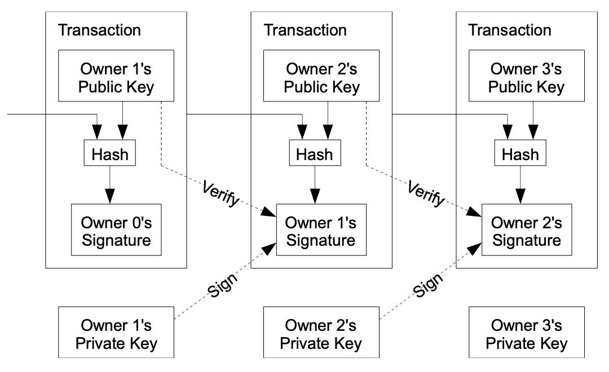
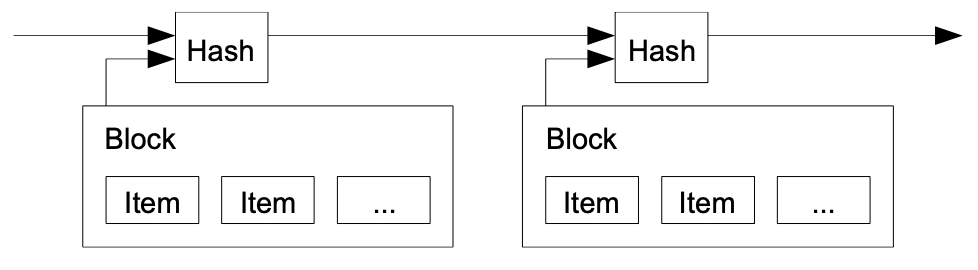
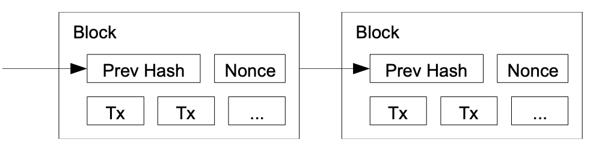
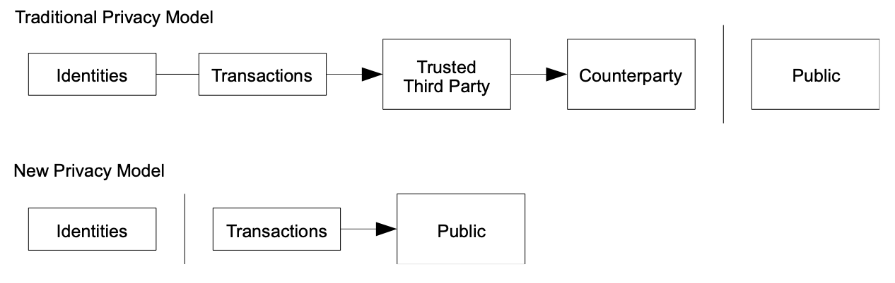

# SHA256-chain
This is a blockchain system developed in NodeJS

## How to run

``
under construction
``

## How does the blockchain works?

Source: <https://bitcoin.org/bitcoin.pdf>

### Transactions

We define an electronic coin as a chain of digital signatures. Each owner transfers the coin to the next by digitally signing a hash of the previous transaction and the public key of the next owner and adding these to the end of the coin. A payee can verify the signatures to verify the chain of ownership.

### Timestamp server

The solution we propose begins with a timestamp server. A timestamp server works by taking a hash of a block of items to be timestamped and widely publishing the hash, such as in a newspaper or Usenet post. The timestamp proves that the data must have existed at the time, obviously, in order to get into the hash. Each timestamp includes the previous timestamp in its hash, forming a chain, with each additional timestamp reinforcing the ones before it.

### Proof-of-Work

To implement a distributed timestamp server on a peer-to-peer basis, we will need to use a proof- of-work system similar to Adam Back's Hashcash, rather than newspaper or Usenet posts. The proof-of-work involves scanning for a value that when hashed, such as with SHA-256, the hash begins with a number of zero bits. The average work required is exponential in the number of zero bits required and can be verified by executing a single hash.
For our timestamp network, we implement the proof-of-work by incrementing a nonce in the block until a value is found that gives the block's hash the required zero bits. Once the CPU effort has been expended to make it satisfy the proof-of-work, the block cannot be changed without redoing the work. As later blocks are chained after it, the work to change the block would include redoing all the blocks after it.

### Network

The steps to run the network are as follows:

1) New transactions are broadcast to all nodes.
2) Each node collects new transactions into a block.
3) Each node works on finding a difficult proof-of-work for its block.
4) When a node finds a proof-of-work, it broadcasts the block to all nodes.
5) Nodes accept the block only if all transactions in it are valid and not already spent.
6) Nodes express their acceptance of the block by working on creating the next block in the
chain, using the hash of the accepted block as the previous hash.

### Privacy

The traditional banking model achieves a level of privacy by limiting access to information to the parties involved and the trusted third party. The necessity to announce all transactions publicly precludes this method, but privacy can still be maintained by breaking the flow of information in another place: by keeping public keys anonymous. The public can see that someone is sending an amount to someone else, but without information linking the transaction to anyone. This is similar to the level of information released by stock exchanges, where the time and size of individual trades, the "tape", is made public, but without telling who the parties were.

